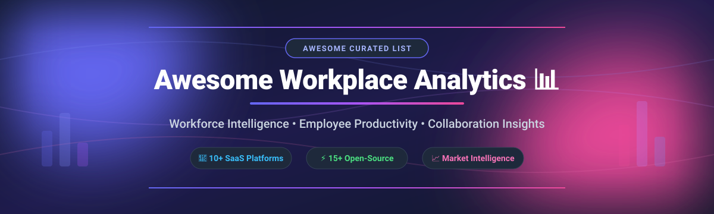

# Awesome Workplace Analytics 📊

    

> **The Definitive Curated Directory of SaaS Products, Workforce Intelligence Tools & Open-Source Workplace Analytics GitHub Projects.**  
> *Track employee productivity metrics, collaboration insights, meeting hygiene, workforce engagement, and time management software.*

---

## 💡 Ecosystem Overview & Market Dynamics

The global **Workplace Analytics & Workforce Intelligence sector** is estimated at **$2.5 Billion to $3.2 Billion** (as of 2026) and is projected to expand at a CAGR of ~15–18%. 

**Sector Structure**: The market is **moderately fragmented**. 
- **Platform Enterprise Heavyweights**: Tech giants (Microsoft Viva Insights) and Zoom (Workvivo) control significant enterprise seat share.
- **Specialized Niche Pioneers**: Mid-market categories (Time Tracking, Privacy-first ONA, Employee Experience & Surveys) are contested by specialized players like ActivTrak, Teramind, Culture Amp, and Hubstaff. 
- **Open-Source Landscape**: Self-hosted solutions (Kimai, Ever Gauzy) lead in data-sovereign time tracking, while commercial platforms maintain dominance in validated behavioral benchmarks and organizational network analysis.

---

## 📌 Table of Contents

- [🏢 SaaS & Hosted Platforms](#-saas--hosted-platforms)
- [🔓 Open-Source GitHub Projects](#-open-source-github-projects)
- [🛠️ How to Contribute](#️-how-to-contribute)
- [💖 Support & Sponsorship](#-support--sponsorship)
- [⭐ Star History](#-star-history)
- [⚠️ Disclaimer](#️-disclaimer)

---

## 🏢 SaaS & Hosted Platforms

*Sorted by Company Size / Valuation / Revenue (Descending)*

| Product | Description | Company Size / Valuation / Revenue | Pricing (Starting Tier) | Free Tier / Trial Limits |
| :--- | :--- | :--- | :--- | :--- |
| **[Microsoft Viva Insights](https://www.microsoft.com/microsoft-viva/insights)** 🏢 | Personal & organizational productivity analytics integrated with M365. Measures collaboration hours, email activity, meeting time, and Copilot adoption. | **~$3 Trillion Market Cap** (Microsoft M365 Ecosystem Leader) | **$4.00/user/month** (Standalone) / **$6.00/user/month** (Add-on) | **Included free** basic personal insights with M365 E3/E5; **30-day free trial** for paid organizational features. |
| **[Culture Amp](https://www.cultureamp.com/)** 📈 | Employee experience platform combining engagement surveys, performance management, and skills benchmarks. | **$2.0 Billion Valuation** (~$227M ARR) | **$4,500/year minimum** (Self-Starter tier, quote-based) | **No free trial** (Sales demo available upon request). |
| **[Workvivo](https://workvivo.com/)** 💬 | Employee engagement & communication platform with video, podcast, and social networking (acquired by Zoom). | **~$270M Acquisition Value** (€69.4M ARR under Zoom) | **$20,000/year initial commitment** (Enterprise quote) | **No free trial** (Interactive product demo provided by sales team). |
| **[Perceptyx](https://www.perceptyx.com/)** 📊 | Enterprise employee survey and people analytics platform covering onboarding, lifecycle, and exit stages. | **~$113M–$200M Revenue** (PE-Backed Enterprise Scale) | **Custom enterprise quote** (Per employee/year structure) | **No free trial** (Guided product demo available upon request). |
| **[ActivTrak](https://www.activtrak.com/)** ⚡ | Workforce analytics & productivity monitoring platform tracking app usage, idle time, and efficiency trends. | **>$50M ARR** ($77.5M VC Raised, Francisco Partners backed) | **$10.00/user/month** (Essentials, annual, 5-user min) | **Free Forever plan**: Limited to **3 users** & **30 days** history; **14-day free trial** for paid plans. |
| **[Hubstaff](https://hubstaff.com/)** ⏱️ | Time tracking & workforce management platform with task tracking, idle timeouts, and suspicious activity detection. | **~$33M–$56M ARR** (Bootstrapped & Profitable Leader) | **$4.99/seat/month** (Starter, annual, 2-seat min) | **Free plan**: **1 user** maximum with basic time tracking; **14-day free trial** for paid plans. |
| **[Teramind](https://www.teramind.com/)** 🛡️ | Insider threat management & employee monitoring platform covering activity tracking, DLP, and behavioral analytics. | **~$15M–$28M ARR** (Private Security & Monitoring Scale) | **$14.99/user/month** (Starter, annual, 5-user min) | **7-day free trial** (Cloud) / **14-day free trial** (On-Premises, capped at 5 users). |
| **[Time Doctor](https://www.timedoctor.com/)** 🩺 | Time tracking & productivity platform featuring AI benchmarks, unusual activity detection, and mouse jiggler detection. | **~$10M–$20M ARR** (Global Remote Workforce Leader) | **$6.67/user/month** (Basic plan, billed annually) | **14-day free trial** (Full feature access, no credit card required). |
| **[Humanyze](https://humanyze.com/)** 🧠 | Behavioral analytics & Organizational Network Analysis (ONA) producing an Organizational Health Score. | **~$5M–$10M Revenue** (MIT Media Lab Spin-off) | **Enterprise custom quote** (Tailored annual subscription) | **No free trial** (14-day money-back guarantee on Humanyze Pulse). |
| **[Worklytics](https://www.worklytics.co/)** 🔒 | Privacy-first workplace analytics platform analyzing collaboration patterns & AI adoption across 50+ integrations. | **~$1.3M–$3.2M Revenue** (Specialized Privacy Leader) | **$2,500/month** (Business tier for 100–1,000 employees) | **Free tier**: Up to **100 users** with calendar data only. |

---

## 🔓 Open-Source GitHub Projects

*Sorted by GitHub Star Count (Descending)*

| Repository & Stars | Description | Tech Stack & License | Key Focus |
| :--- | :--- | :--- | :--- |
| **[Ever Gauzy](https://github.com/ever-co/ever-gauzy)**   | Open Business Management Platform (ERP/CRM/HRM/PM) with integrated workforce analytics and time tracking. | TypeScript, NestJS, Angular (MIT) | Integrated HR, ERP & Productivity |
| **[Kimai](https://github.com/kimai/kimai)**   | Leading open-source web-based multi-user time-tracking application. Track times, generate reports, create invoices. | PHP, Symfony, MySQL (MIT) | Time Tracking & Invoicing |
| **[ActivityWatch](https://github.com/ActivityWatch/activitywatch)**   | Popular automated open-source time tracker that respects user privacy. Cross-platform activity logging. | Python, Rust, Vue.js (MPL-2.0) | Automated Privacy-First Tracking |
| **[Toggl Track CLI / Community](https://github.com/toggl/toggl-cli)**   | Command-line interface and open tools for tracking work hours and project analytics via Toggl API. | Python (MIT) | CLI Developer Workflows |
| **[Alignify](https://github.com/iam-tsr/alignify)**   | AI-powered employee engagement platform for anonymous feedback, using Qwen model & DistilBERT feedback classification. | Python, React, AI (MIT) | AI Feedback & Survey Analytics |
| **[timetrace](https://github.com/dominikbraun/timetrace)**   | Simple, zero-config CLI for tracking working time, tailored for developer terminal workflows. | Go (MIT) | Terminal Time Tracker |
| **[tietracker](https://github.com/peterpeterparker/tietracker)**   | Simple, lightweight cross-platform time tracking application for small teams and freelancers. | TypeScript, Stencil (MIT) | Cross-Platform Time Tracking |
| **[TeamTrack](https://github.com/goodmagma/teamtrack)**   | Web-based, self-hosted team time tracking application with custom reporting dashboards. | PHP, Laravel, Livewire (MIT) | Team Time & Activity Logs |
| **[Zeiterfassung](https://github.com/urlaubsverwaltung/zeiterfassung)**   | Digital working time recording system built for compliance with European & German labor laws. | Java, Docker (Apache-2.0) | Compliance & Working Hours |
| **[Employee Performance Analytics](https://github.com/Equaliserspasticparalysis650/Employee-Performance-Analytics)**   | SQL and Python analytics pipeline for employee performance, efficiency trends, and workload balancing. | Python, SQL, Streamlit (MIT) | HR KPI Dashboards & Analytics |
| **[timesheet](https://github.com/rfrost-xyz/timesheet)**   | Python SQLite terminal application for tracking time entries across projects and tasks. | Python, SQLite (MIT) | Terminal Timesheet Manager |

---

## 🛠️ How to Contribute

Contributions are welcome and appreciated! Help keep this workplace analytics catalog up to date:

1. 🍴 **Fork the Repository**
2. 📝 **Add/Update Entries** in `README.md` following the established table structure.
3. 🔍 **Provide Factual Data**: Include verifiable links, starting prices, free tier limits, and tech stacks.
4. 🚀 **Submit a Pull Request** with a clear explanation of your changes.

---

## 💖 Support & Sponsorship

If you found this curated list helpful for evaluating workplace analytics, workforce intelligence, or open-source time tracking tools:

- ⭐ **Star this repository** to help others discover it!
- 🔀 **Fork and share** with your HR, People Analytics, or Operations teams.
- ☕ **Buy me a coffee / Sponsor**: Support ongoing maintenance of awesome developer & analytics lists via the [GitHub Sponsor Dashboard](https://github.com/sponsors/ishandutta2007).

---

## ⭐ Star History

---

## ⚠️ Disclaimer

- This is a **community-curated list** for informational and educational purposes — not an official endorsement.
- **Privacy & Ethics**: Workplace analytics tools handle sensitive workforce metadata. Always ensure strict compliance with GDPR, CCPA, employment privacy laws, and ethical workplace monitoring guidelines.

---

  <b>Curated with ❤️ for HR leaders, People Analytics professionals, and Open-Source enthusiasts.</b>

